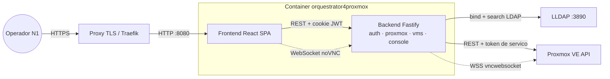
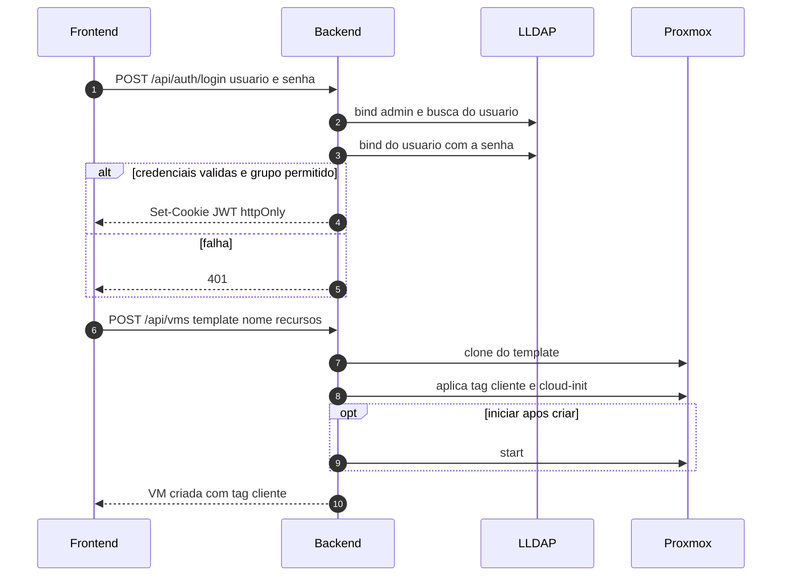

# orquestrator4proxmox

Painel web para **operadores N1** provisionarem e gerenciarem **VMs de cliente** num
**Proxmox VE**, de forma rápida e objetiva — sem dar a eles acesso ao Proxmox nativo.
Autenticação via **LLDAP**. Backend Node/Fastify + frontend React, numa única imagem Docker.

- **Lista apenas VMs de cliente** (por tag), escondendo VMs de gestão/infra.
- **Cria** VMs por **clone de template**, com ajustes (recursos, rede, cloud-init).
- **Ciclo de vida**: start / shutdown / stop / reboot / delete (com confirmação).
- **Console** da VM via **noVNC embutido** (o token do Proxmox nunca vai ao browser).
- **Contabilização simplificada** (total, ligadas/desligadas, vCPU/RAM alocados).

## Recursos

| Área | Detalhe |
|---|---|
| Visibilidade | Só VMs com a tag `cliente` (configurável); tags ocultas (`mgmt`,`infra`) nunca aparecem. A regra é **revalidada no servidor em toda rota** (404 para VMs não-cliente). |
| Criação | Clone de template Proxmox + tag `cliente` + `cores`/`memory`/disco/rede (DHCP ou IP fixo) + cloud-init (usuário, senha ou chave SSH). |
| Auth | LLDAP (bind + busca), sessão JWT em cookie `httpOnly`, restrição opcional por grupo. |
| Console | Proxy WebSocket do backend para o `vncwebsocket` do Proxmox; o browser recebe só um ticket VNC de curta duração. |

## Arquitetura



O **token do Proxmox nunca vai ao browser**: fica só no backend. O frontend só fala com o
backend (REST + WebSocket). O backend alcança o LLDAP pela rede `ldap` e o Proxmox por HTTPS.

## Fluxo — login e criação de VM



## Variáveis de ambiente

| Variável | Obrigatória | Default | Descrição |
|---|---|---|---|
| `PROXMOX_URL` | sim | — | URL da API Proxmox (ex.: `https://proxmox.example.com:8006/`) |
| `PROXMOX_TOKEN_ID` | sim | — | ID do API token de serviço (`user@realm!nome`) |
| `PROXMOX_TOKEN_SECRET` | sim | — | Segredo do API token |
| `PROXMOX_TLS_INSECURE` | não | `false` | `true` só para cert self-signed (dev); em produção use cert válido |
| `PROXMOX_CLIENT_TAG` | não | `cliente` | Tag que marca (e revela) VMs de cliente |
| `PROXMOX_HIDDEN_TAGS` | não | `mgmt,infra` | Tags que ocultam VMs, mesmo com a tag cliente |
| `PROXMOX_TARGET_STORAGE` | não | `local-zfs` | Storage de destino do clone |
| `LDAP_URL` | não | `ldap://lldap_server:3890` | Endpoint LDAP |
| `LDAP_BASE_DN` | não | `dc=example,dc=com` | Base DN do diretório |
| `LDAP_BIND_DN` | não | `uid=admin,ou=people,dc=example,dc=com` | Conta de bind (admin do lldap) |
| `LDAP_BIND_PASSWORD` | sim | — | Senha da conta de bind |
| `LDAP_REQUIRED_GROUP` | não | (vazio) | Se setado, só membros deste grupo logam |
| `JWT_SECRET` | sim | — | Segredo dos tokens de sessão (`openssl rand -hex 32`) |
| `SESSION_TTL` | não | `8h` | Duração da sessão |
| `PORT` | não | `8080` | Porta interna do container |

Veja [`backend/.env.example`](backend/.env.example).

## Uso (Docker)

```bash
docker run -d -p 8080:8080 --env-file .env \
  ghcr.io/marcelofmatos/orquestrator4proxmox:latest
```

A imagem serve a SPA e a API na mesma porta (`8080`). Para produção, coloque atrás de um
proxy TLS (Traefik/Caddy/Nginx) e ligue-a às redes do Proxmox/LDAP conforme seu ambiente.

## Desenvolvimento

```bash
# Backend (Fastify + TS)
cd backend && npm install && npm test        # 48 testes (Vitest)
npm run dev                                   # http://localhost:8080

# Frontend (React + Vite)
cd frontend && npm install && npm test
npm run dev                                   # http://localhost:5173 (proxy /api -> :8080)
```

Testes com **Vitest**; o backend cobre a fronteira de visibilidade por tag, a autenticação
LDAP (injection/bypass/disclosure), o cliente Proxmox e as rotas. `tsc --noEmit` limpo nos
dois pacotes.

## Imagem e versionamento

Imagens publicadas em **GHCR** (`ghcr.io/marcelofmatos/orquestrator4proxmox`) pelo workflow
**Release and build** (`.github/workflows/release-and-build.yml`), versionadas em SemVer
(`x.y.z`, `x.y`, `x`, `latest`). Para rollback, aponte a tag da imagem para uma versão anterior.

## Segurança

- Fronteira de isolamento revalidada no servidor em toda operação de VM (um operador nunca
  alcança VMs de gestão, nem por vmid direto ou por UPID de tarefa).
- Filtros LDAP com escaping (RFC 4515); senha vazia rejeitada (evita unauthenticated bind);
  erros internos não vazam ao cliente; autentica antes de autorizar.
- Entrada validada com `zod` (nome de VM, IP/CIDR do cloud-init) para evitar injeção.
- Container roda como usuário não-root.

## Licença

MIT.
